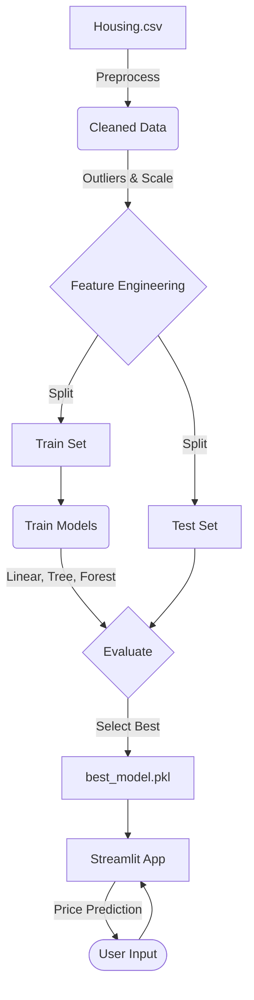

# Estate Intelligence

This project is a machine learning pipeline and web application built to predict house prices based on various property features like area, bedrooms, and amenities. We're using a standard housing prices dataset to train our regression models and serving the final predictions through a Streamlit interface.

## Project Architecture



## Inputs and Outputs

The model takes the following property features as inputs:
- **Numerical:** Area (sq ft), number of bedrooms, bathrooms, stories, and parking capacity.
- **Categorical:** Main road access, guest room, basement, hot water heating, air conditioning, preferred neighborhood, and furnishing status.

It outputs a single numerical value: the estimated price of the house in INR.

## Model Performance

Based on the evaluation of the cleaned test dataset:

- Baseline (Linear Regression):	`RMSE = 1,331,071 | R² = 0.6495`
- Decision Tree: `RMSE = 1,715,038 | R² = 0.4181`
- Random Forest (tuned): `RMSE = 1,407,359 | R² = 0.6081`

The tuned Random Forest model was selected for the application due to its robustness against overfitting and its ability to handle feature interactions, achieving a validated CV R² of ~0.608.

## Local Setup

To run this project on your local machine:

1. Clone the repository:
   ```bash
   git clone <your-repo-link>
   cd estate-intelligence
   ```

2. Set up a virtual environment and install the required packages:
   ```bash
   python -m venv venv
   source venv/bin/activate  # Or `venv\Scripts\activate` on Windows
   pip install -r requirements.txt
   ```

3. Launch the Streamlit application:
   ```bash
   streamlit run app.py
   ```

## Deployment

The application is structured to be easily deployed on Streamlit Cloud or HuggingFace Spaces. The latest code runs automatically on the main branch.