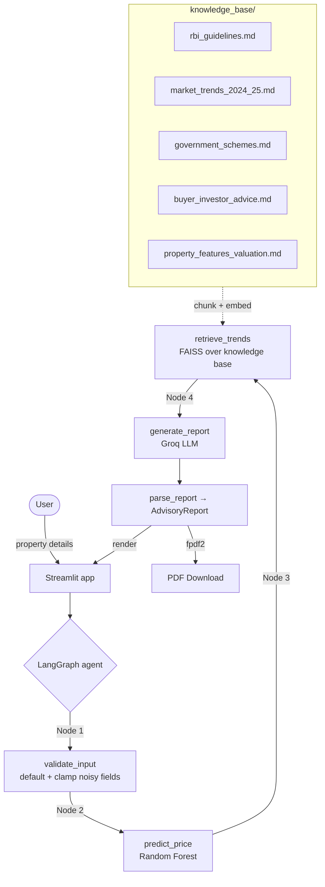

# Estate Intelligence

An end-to-end property advisory tool for the Indian real estate market. A tuned Random Forest predicts the price, a LangGraph agent retrieves grounded market + regulatory context from a FAISS knowledge base, a Groq LLM turns everything into a structured 6-section advisory report, and the UI lets you download it as a styled PDF.

## What's inside

- **Price prediction** — tuned Random Forest on the classic housing dataset (area, bedrooms, bathrooms, stories, amenities, furnishing).
- **RAG knowledge base** — 5 curated documents on RBI home-loan rules, 2024-25 market trends, PMAY / tax / RERA schemes, buyer-investor checklists, and per-feature valuation heuristics for Indian property. Embedded with `all-MiniLM-L6-v2` and indexed in FAISS.
- **LangGraph agent** — four nodes (`validate_input → predict_price → retrieve_trends → generate_report`) with graceful handling of missing/noisy input.
- **Structured report** — Pydantic-validated `AdvisoryReport` with 6 sections parsed from the LLM output.
- **PDF export** — styled A4 report via `fpdf2` (header bar, feature grid, section cards, footer disclaimer).
- **Streamlit UI** — 4 tabs: Predict · Data Insights · Batch CSV · AI Advisory (with live agent trace + PDF download).

## Architecture


```mermaid
graph TD
    U([User]) -->|property details| UI[Streamlit app]
    UI --> G{LangGraph agent}
    G -->|Node 1| V[validate_input<br/>default + clamp noisy fields]
    V -->|Node 2| P[predict_price<br/>Random Forest]
    P -->|Node 3| R[retrieve_trends<br/>FAISS over knowledge base]
    R -->|Node 4| L[generate_report<br/>Groq LLM]
    L --> PA[parse_report → AdvisoryReport]
    PA -->|render| UI
    PA -->|fpdf2| PDF[PDF Download]

    subgraph KB[knowledge_base/]
      K1[rbi_guidelines.md]
      K2[market_trends_2024_25.md]
      K3[government_schemes.md]
      K4[buyer_investor_advice.md]
      K5[property_features_valuation.md]
    end
    KB -.chunk + embed.-> R
```

## Repository layout

```
agent/                LangGraph nodes, state schema, compiled graph
rag/                  ingestion, retriever, knowledge_base/, vector_store/
report/               AdvisoryReport schema, markdown parser, PDF exporter
models/               trained Random Forest + scaler artefacts
data/                 cleaned housing dataset
notebooks/            training + EDA notebooks
app.py                Streamlit UI (4 tabs)
retrain_model.py      reproducible retraining script
```

## Model performance

Evaluated on the held-out test set:

| Model                       |          RMSE |     R²  |
|-----------------------------|--------------:|--------:|
| Linear Regression (baseline)|   1,331,071   |  0.6495 |
| Decision Tree               |   1,715,038   |  0.4181 |
| **Random Forest (tuned)**   | **1,407,359** | **0.6081** |

The tuned Random Forest is the production model — selected for robustness and feature-interaction handling. MAE is ≈ ₹10,25,000; the agent surfaces this in the advisory so users understand the uncertainty band.

## Local setup

```bash
git clone https://github.com/Lex-Ashu/estate-intelligence.git
cd estate-intelligence

python -m venv venv
source venv/bin/activate       # venv\Scripts\activate on Windows
pip install -r requirements.txt

cp .env.example .env
# edit .env and set GROQ_API_KEY=<your free key from console.groq.com>

streamlit run app.py
```

The FAISS index is pre-built and checked into `rag/vector_store/`, so the app works on a cold clone without a build step. If you edit anything under `rag/knowledge_base/`, rebuild with:

```bash
python -m rag.ingest
```

## Environment

| Variable        | Where to get it                              | Required for |
|-----------------|----------------------------------------------|--------------|
| `GROQ_API_KEY`  | [console.groq.com](https://console.groq.com) | Tab 4 (AI Advisory) — the LLM call |

Tabs 1–3 (single predict, insights, batch CSV) work without any API key.

## Deploying on Hugging Face Spaces

1. Create a new Space → **SDK: Streamlit**.
2. Push this repo to the Space's git remote (or use the UI upload).
3. In **Settings → Variables and secrets**, add `GROQ_API_KEY` as a secret.
4. The Space will auto-install `requirements.txt` and serve `app.py`.
5. First cold start takes ~2-3 min to download the sentence-transformers model; subsequent loads use the HF cache.

The pre-built FAISS index in `rag/vector_store/` means the Space doesn't need to re-ingest — just serves queries.

## Tech stack

- **ML:** scikit-learn (Random Forest), pandas, numpy, joblib
- **Agent:** langgraph, langchain-core, langchain-groq (Llama 3.1 8B Instant via Groq)
- **RAG:** sentence-transformers (`all-MiniLM-L6-v2`), faiss-cpu
- **Report:** pydantic 2.x, fpdf2
- **UI:** streamlit, matplotlib

## Disclaimers

Predictions are informational estimates based on a limited dataset and do not constitute financial, legal, or investment advice. The advisory report is LLM-generated grounded on static knowledge base documents — always verify facts against RERA, RBI, and current market sources before any real decision.
