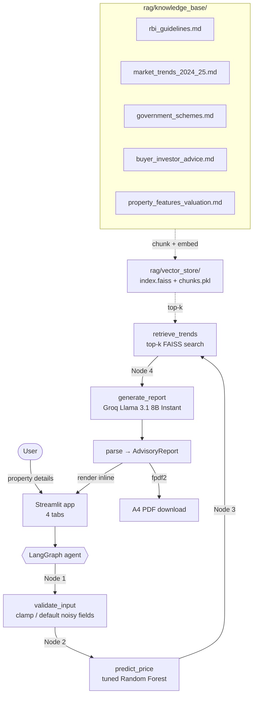

# Estate Intelligence

An end-to-end property advisory system for the Indian real estate market. A tuned Random Forest produces a price estimate, a LangGraph agent retrieves grounded market and regulatory context from a FAISS-indexed knowledge base, a Groq-hosted Llama 3.1 model composes a structured six-section advisory report, and the Streamlit UI lets you download it as a styled PDF.

**Live demo:** https://estate-intelligence-dp4qvmggx4rugxkoafnobw.streamlit.app/

## What's inside

- **Price prediction** — tuned Random Forest over twelve property features (area, bedrooms, bathrooms, stories, five amenity flags, parking, preferred-area flag, and an ordinal furnishing status).
- **RAG knowledge base** — five curated markdown documents covering RBI home-loan rules, 2024-25 market trends, PMAY / RERA / tax schemes, buyer-investor checklists, and per-feature valuation heuristics. Embedded with `all-MiniLM-L6-v2` (384-d) and indexed with FAISS `IndexFlatIP` (cosine via L2-normalised inner product).
- **LangGraph agent** — four nodes (`validate_input` → `predict_price` → `retrieve_trends` → `generate_report`) with graceful fallbacks and per-node step logging.
- **Structured report** — Pydantic-validated `AdvisoryReport` with six fixed sections, parsed from the LLM's markdown via a regex splitter.
- **PDF export** — styled A4 report via `fpdf2` (custom header bar, two-column feature grid, section cards, disclaimer footer; Latin-1 sanitisation for rupee and em-dash glyphs).
- **Streamlit UI** — four tabs (*Predict Price · Data Insights · Batch CSV · AI Advisory*) with a live agent-trace timeline and a one-click PDF download, dressed in a minimal light theme.

## Architecture


```mermaid
graph TD
    U([User]) -->|property details| UI[Streamlit app<br/>4 tabs]
    UI --> G{{LangGraph agent}}
    G -->|Node 1| V[validate_input<br/>clamp / default noisy fields]
    V -->|Node 2| P[predict_price<br/>tuned Random Forest]
    P -->|Node 3| R[retrieve_trends<br/>top-k FAISS search]
    R -->|Node 4| L[generate_report<br/>Groq Llama 3.1 8B Instant]
    L --> PA[parse → AdvisoryReport]
    PA -->|render inline| UI
    PA -->|fpdf2| PDF[A4 PDF download]

    subgraph KB[rag/knowledge_base/]
      K1[rbi_guidelines.md]
      K2[market_trends_2024_25.md]
      K3[government_schemes.md]
      K4[buyer_investor_advice.md]
      K5[property_features_valuation.md]
    end
    KB -.chunk + embed.-> VS[rag/vector_store/<br/>index.faiss + chunks.pkl]
    VS -.top-k.-> R
```

### How a single advisory request flows

1. **`validate_input`** clamps area to `[250, 20_000]` sq ft, caps bedrooms and bathrooms to sensible ranges, defaults missing amenity flags to zero, and appends each intervention to a `validation_errors` list that the UI surfaces as data-quality notes.
2. **`predict_price`** applies the persisted `StandardScaler` and runs the tuned Random Forest, returning a rupee point estimate.
3. **`retrieve_trends`** assembles a natural-language query from the validated feature vector plus the predicted price, pulls the top-4 chunks from the committed FAISS index, and formats them as grounded context. If the RAG stack is unavailable, a hardcoded fallback paragraph keeps the pipeline running.
4. **`generate_report`** prompts Llama 3.1 8B (served via the Groq LPU) with a six-section template, the property context, and the retrieved passages. The raw markdown response is parsed into the `AdvisoryReport` Pydantic schema; empty sections default to a placeholder string so the downstream PDF always renders.

Every node appends a human-readable line to `agent_steps`, which the *AI Advisory* tab renders as the live trace timeline seen in the demo.

## Repository layout

```
agent/                    LangGraph pipeline
  ├─ graph.py              compiled graph
  ├─ nodes.py              4 pipeline nodes
  └─ state.py              TypedDict state schema
rag/                      Ingestion, retrieval, knowledge base
  ├─ ingest.py             chunker + FAISS builder (CLI)
  ├─ retriever.py          top-k retrieval helper
  ├─ knowledge_base/       5 curated .md documents
  └─ vector_store/         committed FAISS index + chunks.pkl
report/                   Structured advisory report
  ├─ schema.py             Pydantic AdvisoryReport
  ├─ parser.py             markdown → schema
  └─ pdf_export.py         fpdf2 A4 renderer
models/                   Trained Random Forest + scaler
data/cleaned/             Cleaned housing dataset (CSV)
notebooks/                EDA + training notebooks + exported PNGs
docs/                     IEEE LaTeX report and bibliography
.streamlit/config.toml    Pinned light theme + hidden toolbar
app.py                    Streamlit UI entry point
retrain_model.py          Reproducible retraining script
requirements.txt
```

## Model performance

Evaluated on the 20% held-out test split (`random_state=42`):

| Model                         |      RMSE (INR) |      MAE (INR)    |      R² |
| ----------------------------- | --------------: | ----------------: | ------: |
| Linear Regression (baseline)  |     1,331,071   | ≈ 9,70,000        |  0.6495 |
| Decision Tree                 |     1,715,038   | ≈ 12,50,000       |  0.4181 |
| **Random Forest (tuned)**     | **1,407,359**   | **≈ 10,25,000**   | **0.6081** |

The tuned Random Forest is the production model — selected for robustness to non-linear price/amenity interactions, native handling of the mixed numeric / ordinal / binary feature set, and interpretable built-in feature importances. The gap to linear regression is well within the MAE band of either model.

## Local setup

```bash
git clone https://github.com/Lex-Ashu/estate-intelligence.git
cd estate-intelligence

python -m venv venv
source venv/bin/activate       # venv\Scripts\activate on Windows
pip install -r requirements.txt

cp .env.example .env
# edit .env and set GROQ_API_KEY=<your free key from console.groq.com>

streamlit run app.py
```

The FAISS index is pre-built and checked into `rag/vector_store/`, so the app runs on a cold clone without a build step. If you edit anything under `rag/knowledge_base/`, rebuild the index with:

```bash
python -m rag.ingest
```

## Environment

| Variable       | Where to get it                              | Required for                 |
| -------------- | -------------------------------------------- | ---------------------------- |
| `GROQ_API_KEY` | [console.groq.com](https://console.groq.com) | Tab 4 (AI Advisory) LLM call |

Tabs 1–3 (single predict, insights, batch CSV) run entirely offline and need no API key.

## Deployment

The app is deployed publicly on **Streamlit Cloud** at the URL above. To replicate on your own account:

1. Create a new Streamlit Cloud app from this GitHub repo, pointing at `app.py` on the `main` branch.
2. In **Settings → Secrets**, add:
   ```toml
   GROQ_API_KEY = "gsk_..."
   ```
3. The committed FAISS index means no re-ingestion is needed — the Space just serves queries.
4. First cold start takes roughly 2 minutes while the `all-MiniLM-L6-v2` weights are fetched; subsequent loads hit the cache.

## Tech stack

- **ML:** scikit-learn (Random Forest, StandardScaler, GridSearchCV), pandas, numpy, joblib
- **Agent:** langgraph, langchain-core, langchain-groq (Llama 3.1 8B Instant served via the Groq LPU)
- **RAG:** sentence-transformers (`all-MiniLM-L6-v2`), faiss-cpu
- **Report:** pydantic 2.x, fpdf2
- **UI:** streamlit, matplotlib

## Team

**Team Logixa** — B.Tech CSE (AI & ML), Semester 4, Newton School of Technology

- Ashu Choudhary
- Gayatri Jaiswal
- Krish Patil
- Sneha Chepurwar

## Disclaimers

Predictions are informational estimates based on a limited dataset (545 samples, no city or locality feature) and do not constitute financial, legal, or investment advice. The advisory report is LLM-generated and grounded on static knowledge-base documents — always verify against live RERA, RBI, and market sources before any real decision.
